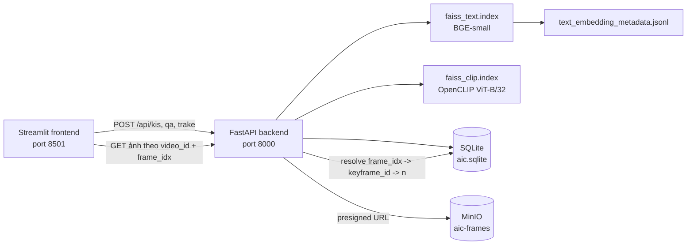

# AIC Video Search Demo

Hệ thống tìm kiếm video cho bài toán AIC, gồm backend FastAPI, FAISS index cho CLIP/text, SQLite metadata, MinIO lưu keyframe và frontend Streamlit. Hệ thống hỗ trợ ba luồng chính: **KIS** để tìm cảnh theo mô tả, **Q&A** để hỏi đáp theo nội dung video và **TRAKE** để tìm chuỗi sự kiện theo thứ tự.

> Mục tiêu của repository là sử dụng các index FAISS đã có sẵn. Không cần rebuild `faiss_clip.index` nếu kiểm tra mapping giữa FAISS, file `.npy` gộp và `id_map.json` vẫn đạt PASS.

## 1. Kiến trúc tổng quan



Luồng KIS gồm các bước encode query bằng BGE và OpenCLIP, tìm kiếm trên hai FAISS index, hợp nhất candidate bằng RRF/object score, sau đó có thể rerank bằng CrossEncoder. Chế độ nhanh có thể bỏ CrossEncoder để giảm độ trễ.

## 2. Cấu trúc thư mục

```
.
├── backend/
│   ├── main.py                    # FastAPI entrypoint
│   ├── dependencies.py            # Khởi tạo singleton model/index/database/MinIO
│   ├── schemas.py                 # Pydantic request schemas
│   ├── database/
│   │   ├── faiss_manager.py       # Load và search hai FAISS index
│   │   └── sqlite_manager.py      # Resolve frame metadata và ASR
│   ├── rag/
│   │   └── pipeline.py            # Retriever, fusion, reranker, KIS/Q&A/TRAKE
│   └── routers/
│       ├── retrieval.py           # /api/kis, /api/qa, /api/trake
│       └── media.py               # Endpoint ảnh keyframe
├── frontend/
│   ├── app.py                     # Streamlit entrypoint
│   ├── api.py                     # HTTP client gọi FastAPI
│   ├── components.py              # Render kết quả và ảnh
│   └── .streamlit/config.toml     # Theme Streamlit
├── pipelines/
│   ├── verify_clip_mapping.py     # Kiểm tra mapping-only
│   └── verify_faiss_row_mapping.py# Kiểm tra row FAISS với source .npy
├── data/
│   ├── aic.sqlite
│   └── index/
│       ├── faiss_clip.index
│       ├── faiss_text.index
│       ├── id_map.json
│       └── text_embedding_metadata.jsonl
├── .env.example
└── requirements.txt
```

## 3. Yêu cầu môi trường

Cần có Python, Git và một MinIO server đang chạy. CUDA không bắt buộc; khi chạy CPU, truy vấn có thể chậm hơn đáng kể so với GPU.

Các package chính gồm FastAPI, Uvicorn, Streamlit, Sentence Transformers, FAISS CPU, PyTorch, OpenCLIP, Faster Whisper, Groq và MinIO SDK.

## 4. Cài đặt trên Windows

Từ PowerShell:

```
py -m venv venv
.\venv\Scripts\Activate.ps1

python -m pip install --upgrade pip
python -m pip install -r requirements.txt
```

Nếu PowerShell chặn activate script, có thể chạy trực tiếp executable trong virtual environment mà không activate:

```
python.exe -m pip install -r requirements.txt
```

Sau khi cài package lần đầu, các model Hugging Face/OpenCLIP có thể được tải về cache. Vì vậy lần khởi động backend đầu tiên có thể lâu hơn các lần sau.

## 5. Chuẩn bị dữ liệu

Backend mặc định tìm dữ liệu ở các vị trí sau:

```
data/aic.sqlite
data/index/faiss_clip.index
data/index/faiss_text.index
data/index/id_map.json
data/index/text_embedding_metadata.jsonl
```

Có thể ghi đè bằng biến môi trường:

```
AIC_DB_PATH=data/aic.sqlite
AIC_INDEX_ROOT=data/index
AIC_CLIP_ID_MAP_PATH=data/index/id_map.json
```

## 6. Tối ưu tốc độ truy vấn

Các biến sau được đọc khi backend khởi động:

```
# Số candidate lấy từ mỗi modality trước bước fusion/rerank
RAG_TOP_K_RETRIEVE=20

# 1 = KIS bỏ CrossEncoder, ưu tiên tốc độ
# 0 = KIS dùng CrossEncoder, ưu tiên chất lượng rerank
RAG_FAST_KIS=1

# 1 = in timing từng bước ra console backend
RAG_PROFILE=0
# 1 = in bucket/key ảnh mà endpoint media đã resolve
RAG_MEDIA_DEBUG=0
```

`RAG_FAST_KIS=1` giúp KIS phản hồi nhanh hơn vì không chạy CrossEncoder trên các candidate. Điểm `score` khi đó là điểm fusion, không phải điểm CrossEncoder. Nếu cần kết quả rerank đầy đủ, đặt `RAG_FAST_KIS=0`.

Các truy vấn sau được hưởng lợi từ cache metadata SQLite. Frontend cũng tải ảnh song song thay vì chờ từng ảnh một. Tuy nhiên, nếu MinIO chưa upload ảnh hoặc endpoint MinIO không truy cập được, thời gian hiển thị vẫn có thể tăng do các request ảnh timeout; nên giữ MinIO cùng mạng với backend/frontend.

Để đo thời gian, đặt tạm:

```
RAG_PROFILE=1
```

Sau khi gửi query, console backend sẽ in dạng:

```
[RAG_PROFILE] text_encode=...s text_search_map=...s clip_encode=...s clip_search_map=...s total_retrieve=...s
[RAG_PROFILE] total_kis=...s fast_kis=True results=...
```

Đo xong nên đặt lại `RAG_PROFILE=0`.

## 7. Khởi động backend trực tiếp trên Windows

Có thể chạy backend ngay từ **thư mục gốc** `D:\aic2026`. Dùng `--app-dir backend` để Uvicorn thêm thư mục `backend` vào Python path, trong khi thư mục làm việc vẫn là root để các đường dẫn tương đối như `data/aic.sqlite` và `data/index` được resolve đúng.

Mở PowerShell thứ nhất:

```
python.exe -m uvicorn main:app `
  --app-dir backend `
  --env-file D:\aic2026\.env `
  --host 0.0.0.0 `
  --port 8000 `
  --reload
```

Nếu virtual environment đã được activate:

```
python -m uvicorn main:app --app-dir backend --env-file D:\aic2026\.env --host 0.0.0.0 --port 8000 --reload
```


Kiểm tra backend:

```
Invoke-RestMethod http://127.0.0.1:8000/api/health
```

Kết quả mong đợi:

```json
{
  "status": "ok"
}
```

Có thể mở tài liệu Swagger tại:

```
http://127.0.0.1:8000/docs
```

## 8. Cấu hình và khởi động Streamlit

Mở PowerShell thứ hai, vẫn tại thư mục gốc:

```
python.exe -m streamlit run frontend/app.py `
  --server.address 127.0.0.1 `
  --server.port 8501
```

Nếu virtual environment đã được activate:

```
python -m streamlit run frontend/app.py --server.address 127.0.0.1 --server.port 8501
```

Mở giao diện tại:

```
http://127.0.0.1:8501
```

Giao diện có ba chế độ:

| Chế độ | Input | Kết quả |
| --- | --- | --- |
| KIS | Mô tả cảnh, ví dụ `người đàn ông áo đỏ đứng cạnh xe hơi` | Danh sách video_id, frame_idx, score và ảnh nếu có |
| Q&A | Câu hỏi về nội dung video | Câu trả lời và nguồn liên quan |
| TRAKE | Nhiều sự kiện theo thứ tự, mỗi dòng một event | Kết quả cho từng event theo đúng thứ tự nhập |

## 9. API contract

### Health check

```
GET /api/health
```

### KIS

Request:

```
POST /api/kis
Content-Type: application/json
```

```json
{
  "query": "người đàn ông áo đỏ đứng cạnh xe hơi",
  "top_n": 10
}
```

Response:

```json
{
  "results": [
    {
      "video_id": "L21_V001",
      "frame_idx": 2205,
      "score": 0.731
    }
  ]
}
```

`frame_id` và `keyframe_id` không nằm trong response công khai.

### Q&A

Request:

```json
{
  "query": "Người đàn ông đang làm gì?",
  "top_n": 10
}
```

Response có dạng:

```json
{
  "answer": "...",
  "sources": [
    {
      "video_id": "L21_V001",
      "frame_idx": 2205,
      "score": 0.731
    }
  ]
}
```

Q&A yêu cầu `GROQ_API_KEY`. Nếu chưa cấu hình, backend trả lỗi HTTP 400 thay vì gọi LLM.

### TRAKE

Request:

```json
{
  "events": [
    "người bước vào phòng",
    "người ngồi xuống ghế",
    "người mở laptop"
  ],
  "top_n": 5
}
```

Response trả danh sách kết quả tương ứng với từng event và giữ nguyên thứ tự event.

### Ảnh keyframe

Frontend gọi:

```
GET /api/keyframe/{video_id}/{frame_idx}/image
```

Ví dụ:

```
http://127.0.0.1:8000/api/keyframe/L21_V001/2205/image
```

Backend không dùng `frame_idx` làm tên file. Backend resolve cặp `video_id + frame_idx` trong SQLite, lấy `n`, rồi tạo presigned URL tới:

```
s3://aic-frames/keyframes/L21_V001/084.jpg
```

Nếu ảnh chưa tồn tại, endpoint trả lỗi không tìm thấy và Streamlit hiển thị placeholder.


## 10. Chạy bằng Docker Compose

Repository có sẵn `docker-compose.yml` cho trường hợp muốn chạy MinIO, backend và frontend bằng container:

```
cd D:\aic2026
docker compose up --build
```

Các cổng mặc định:

| Service | URL |
| --- | --- |
| MinIO API | `http://localhost:9000` |
| MinIO Console | `http://localhost:9001` |
| FastAPI | `http://localhost:8000` |
| Streamlit | `http://localhost:8501` |

Khi chạy Docker, cần bảo đảm thư mục `data/` chứa SQLite và FAISS index trước khi khởi động. Backend container dùng các đường dẫn `/data/aic.sqlite` và `/data/index` theo cấu hình Compose.

## 11. Trạng thái xác minh hiện tại

| Hạng mục | Trạng thái |
| --- | --- |
| FAISS CLIP index | Đã xác minh số vector và chiều embedding |
| Row mapping với file `.npy` gộp | Đã xác minh khớp tuyệt đối trong kiểm tra source-vs-index |
| `id_map.json` | Phủ liên tục row từ 0 đến `ntotal - 1` |
| ASR metadata không có `transcript_id` | Backend đã hỗ trợ resolve theo video và thời gian |
| Public result schema | `video_id`, `frame_idx`, `score` |
| MinIO upload từng phần | Có fallback placeholder khi ảnh thiếu |
| Tối ưu KIS | Có giảm top-k, cache SQLite, fast mode và profiling |
